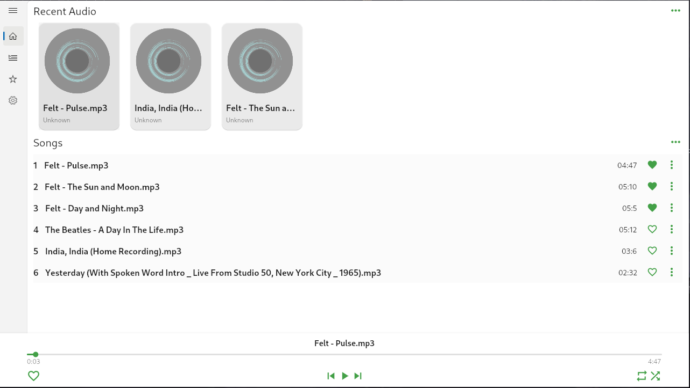

# SeiorMusic
Dekstop Music App Using Flutter.



## TODO
- Fix Bug
- Add youtube downloader
- Add assest
- Add multi language

## Build
Plase make sure you already installed Linux toolchain for Linux or Visual Studio for Windows to build app from repository.

To check if Linux Toolcain or Visual studio. run
```bash
$ flutter doctor
```

Plone repository first and run
```bash
$ git clone https://github.com/radenrishwan/seiormusic
$ flutter build <platform> --release # example : flutter build linux --release
```

Pou can find out build app at  build folder.